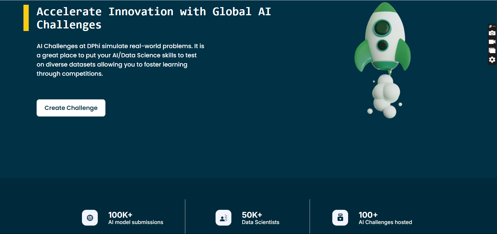
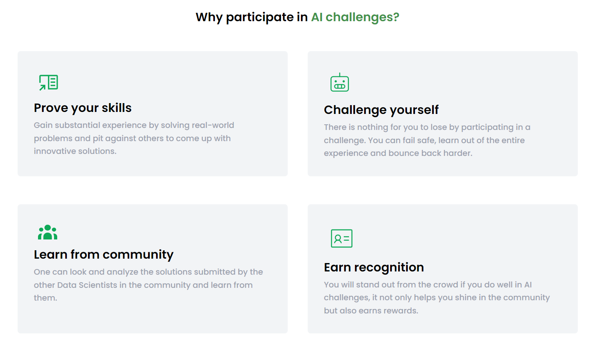
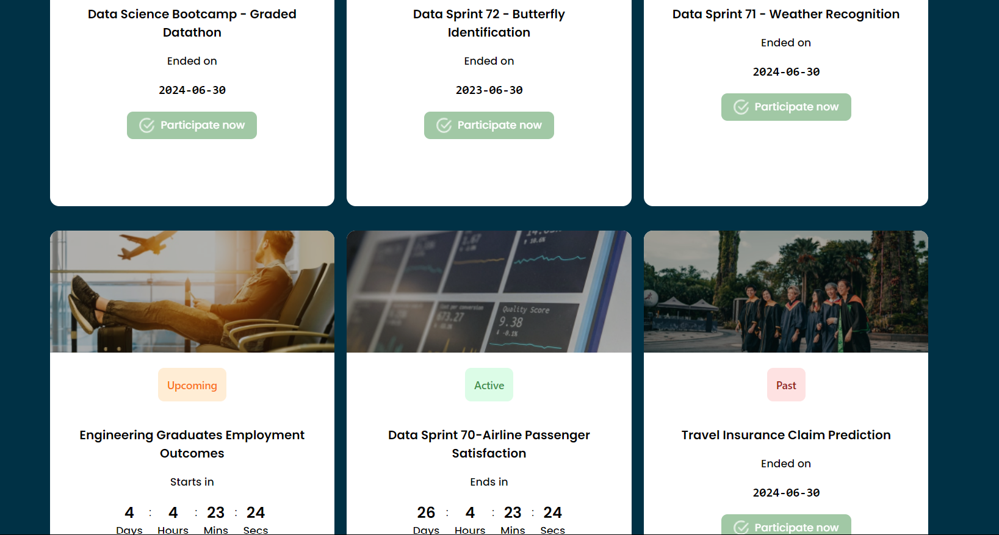
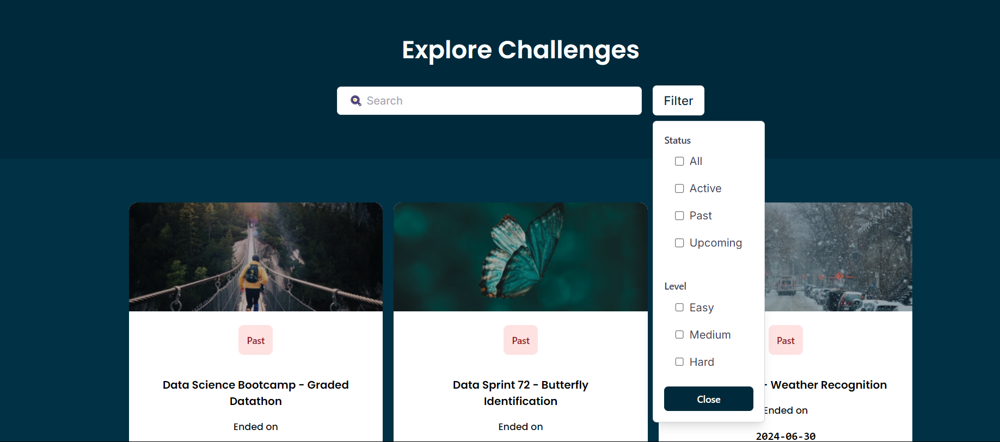
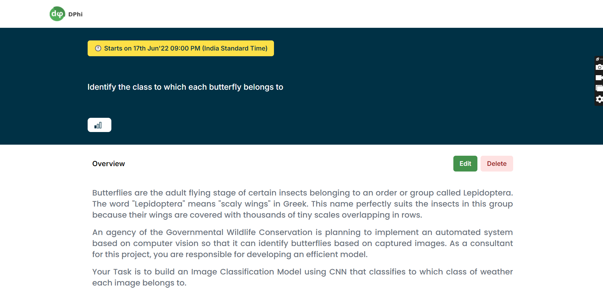
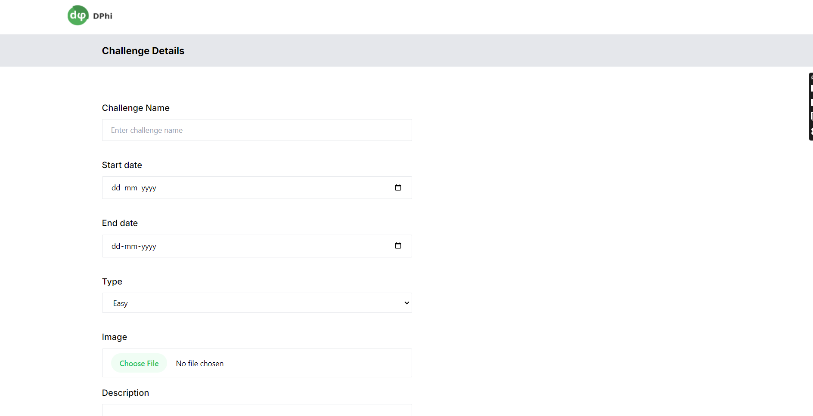
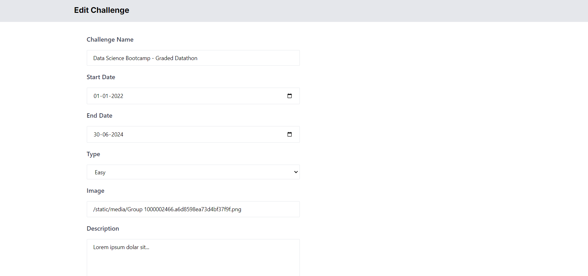

## AI Planet Hackathon

# Snippets

# Tech Stacks

React.JS, Tailwind CSS

# Instructions

To start, clone the repository by executing the command: "git clone [https://github.com/ay690/AI-Planet-Hackathon.git]". After cloning, navigate into the repository directory and install dependencies using the command "npm install". Once the installation is complete, run the code with "npm start". Ensure to execute these commands in your terminal.
